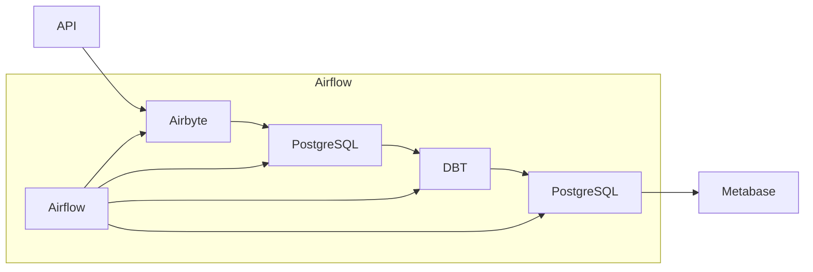

# Análise Casos Covid-19

Este projeto cria um pipeline de dados para coletar, armazenar, transformar e visualizar dados de casos de Covid-19 no Brasil. Os dados são coletados da API do [Covid-19 Brasil.io](https://brasil.io/dataset/covid19/caso/), armazenados em um banco de dados PostgreSQL, transformados com DBT e visualizados em um painel de Metabase.

Os dados são `coletados`, `transformados`, `armazenados` e `visualizados` em um painel de Business Intelligence (BI).

## Videos do Projeto

- [Vídeo 1 - Parte 1](https://youtu.be/ZjVKkVJZNus)
- [Vídeo 2 - Parte 2](https://youtu.be/7mIk_X3M2K0)


## Arquitetura do Projeto



## Tecnologias Utilizadas

- `Airbyte`: Para integração e extração de dados da API Brasil.io.

- `Airflow`: Para orquestração de ELT (Extract, Load, Transform).

- `PostgreSQL`: Será nosso DW (Data Warehouse) para armazenamento e modelagem de dados.

- `DBT (Data Build Tool)`: Nossa ferramenta de modelagem, ela também vai zelar pela qualidade dos dados.

- `Metabase`: Será nossa dataviz, onde vamos criar painéis para visualização dos dados.

- `Grafana`: Para monitoramento e visualização de métricas do ambiente.

## Estrutura do Projeto

- Coleta de Dados
    - Criar uma conta no `Brasil.io` para acessar a API de casos de Covid-19.
    - Configurar `Airbyte` para integração com a API.
    - Configurar `Airbyte` para enviar dados coletados para o `PostgreSQL`.

- Orquestração de Tarefas
    - Configurar `Airflow` para agendamento e execução da connection no `Airbyte`.

- Armazenamento de Dados
    - Configurar `PostgreSQL` para armazenamento de dados brutos e transformados.

- Transformação de Dados
    - Criar modelos `DBT` para transformação e limpeza de dados no `PostgreSQL`.

- Visualização de Dados
    - Criar painéis no `Metabase` para visualização dos dados.

- Monitoramento
    - `Grafana` para visualização de métricas.

## Passo a Passo para Implementação

1. Já configuramos nosso ambiente de desenvolvimento pode ver completo [aqui](https://github.com/Linhares015/athena_stack_infra)

2. Configuração do Airbyte

    - Acesse a interface do Airbyte em http://localhost:8000.
    - Build uma nova conexão para a API Brasil.io:
    - Minha configuração:
<details>
  <summary>Config</summary>

  Aqui está o YAML da conexão:

```yaml
version: 3.9.6

type: DeclarativeSource

check:
  type: CheckStream
  stream_names:
    - caso

definitions:
  streams:
    caso:
      type: DeclarativeStream
      name: caso
      retriever:
        type: SimpleRetriever
        requester:
          $ref: '#/definitions/base_requester'
          path: covid19/caso/data/
          http_method: GET
        record_selector:
          type: RecordSelector
          extractor:
            type: DpathExtractor
            field_path: []
      schema_loader:
        type: InlineSchemaLoader
        schema:
          $ref: '#/schemas/caso'
  base_requester:
    type: HttpRequester
    url_base: https://api.brasil.io/v1/dataset/
    authenticator:
      type: ApiKeyAuthenticator
      api_token: Token {{ config['api_key'] }}
      inject_into:
        type: RequestOption
        field_name: Authorization
        inject_into: header

streams:
  - $ref: '#/definitions/streams/caso'

spec:
  type: Spec
  connection_specification:
    type: object
    $schema: http://json-schema.org/draft-07/schema#
    required:
      - api_key
    properties:
      api_key:
        type: string
        order: 0
        title: API Key
        airbyte_secret: true
    additionalProperties: true

metadata:
  autoImportSchema:
    caso: false
  yamlComponents:
    global:
      - authenticator
  testedStreams:
    caso:
      streamHash: ada76e961edbf298e4ca03ac480196f6343b6cbc
      hasResponse: true
      responsesAreSuccessful: true
      hasRecords: true
      primaryKeysArePresent: true
      primaryKeysAreUnique: true

schemas:
  caso:
    type: object
    $schema: http://json-schema.org/schema#
    properties:
      count:
        type:
          - number
          - 'null'
      next:
        type:
          - string
          - 'null'
      previous:
        type:
          - string
          - 'null'
      results:
        type: array
        items:
          type: object
          properties:
            city_ibge_code:
              type:
                - string
                - 'null'
            confirmed:
              type:
                - number
                - 'null'
            confirmed_per_100k_inhabitants:
              type:
                - number
                - 'null'
            date:
              type:
                - string
                - 'null'
            death_rate:
              type:
                - number
                - 'null'
            deaths:
              type:
                - number
                - 'null'
            estimated_population:
              type:
                - number
                - 'null'
            estimated_population_2019:
              type:
                - number
                - 'null'
            is_last:
              type:
                - boolean
                - 'null'
            order_for_place:
              type:
                - number
                - 'null'
            place_type:
              type:
                - string
                - 'null'
            state:
              type:
                - string
                - 'null'
          required:
            - city_ibge_code
            - confirmed
            - date
            - state
    required:
      - results
    additionalProperties: true
```
</details>

- Configurar Destino no Airbyte

    - Configure o PostgreSQL como destino:
        - Host: seu_host_postgres
        - Port: 5432
        - Database: airbyte
        - Username: seu_usuario
        - Password: sua_senha

3. Configuração do Airflow
    - Criar DAG no Airflow
    - Crie um arquivo DAG no Airflow para orquestrar as tarefas de ETL:
    - Meu repositorio de DAGs é: https://github.com/Linhares015/athena_dags

<details>
  <summary>Minha DAG</summary>

  Aqui está o minha DAG:

```python
from datetime import timedelta
from airflow import DAG
from airflow.operators.python_operator import PythonOperator
from airflow.utils.dates import days_ago
import requests
from requests.auth import HTTPBasicAuth
import logging
import time

default_args = {
    'owner': 'airflow',
    'depends_on_past': False,
    'email_on_failure': False,
    'email_on_retry': False,
    'retries': 1,
    'retry_delay': timedelta(minutes=1),
}

def trigger_airbyte_covid_19():
    airbyte_connection_id = 'e168f861-2732-425f-b376-cecca3e28d93'
    airbyte_covid_19_url = 'http://192.168.124.31:8001/api/v1/connections/sync'
    airbyte_job_status_url = 'http://192.168.124.31:8001/api/v1/jobs/get'
    headers = {'Content-Type': 'application/json'}
    payload = {'connectionId': airbyte_connection_id}
    
    auth = HTTPBasicAuth('airbyte', 'password')
    
    response = requests.post(airbyte_covid_19_url, headers=headers, json=payload, auth=auth)
    response.raise_for_status()
    
    job_id = response.json()['job']['id']
    logging.info('Airbyte sync job started: %s', job_id)
    
    timeout = 3600
    check_interval = 3
    elapsed_time = 0
    
    while elapsed_time < timeout:
        job_status_response = requests.post(airbyte_job_status_url, headers=headers, json={'id': job_id}, auth=auth)
        job_status_response.raise_for_status()
        job_status = job_status_response.json()['job']['status']
        
        if job_status == 'succeeded':
            logging.info('Airbyte sync succeeded: %s', job_status_response.json())
            return {'job_id': job_id, 'status': 'succeeded'}
        elif job_status == 'failed':
            logging.error('Airbyte sync failed: %s', job_status_response.json())
            raise Exception('Airbyte sync failed')
        else:
            logging.info('Airbyte sync in progress: %s', job_status)
            time.sleep(check_interval)
            elapsed_time += check_interval
    
    raise Exception('Airbyte sync timed out')

with DAG(
    'airbyte_covid_19_dag',
    default_args=default_args,
    description='DAG to trigger Airbyte sync',
    schedule_interval=timedelta(days=1),
    start_date=days_ago(1),
    tags=['airbyte','postgres_DW','covid_19', 'API_brasil_io'],
) as dag:

    run_airbyte_covid_19 = PythonOperator(
        task_id='run_airbyte_covid_19',
        python_callable=trigger_airbyte_covid_19,
    )

    run_airbyte_covid_19
```
</details>

4. Configuração do PostgreSQL
Configurar Esquemas e Tabelas
Conecte-se ao PostgreSQL e crie os esquemas e tabelas necessários para armazenar os dados brutos e transformados.

5. Desenvolvimento da Transformação de Dados no DBT.
    - Crie modelos DBT para transformar e limpar os dados brutos.
    - Meu repositorio de DBTs é: https://github.com/Linhares015/athena_dbt

6. Visualização de Dados no Metabase

    - Crie painéis para visualizar preços atuais, históricos e tendências de mercado.
    - Indicadores de Desempenho (KPIs) sugeridos:
    - Preço atual (current_price)
    - Capitalização de mercado (market_cap)
    - Volume total (total_volume)
    - Variação percentual de preço nas últimas 24h (price_change_percentage_24h)
    - Maior preço nas últimas 24h (high_24h)
    - Menor preço nas últimas 24h (low_24h)

7. Monitoramento com Prometheus e Grafana
Configurar Prometheus

## Considerações Finais

Este projeto demonstra habilidades em integração de dados, ETL, armazenamento e visualização em BI, utilizando uma infraestrutura completa com Airbyte, Airflow, PostgreSQL, DBT, Prometheus e Grafana.
