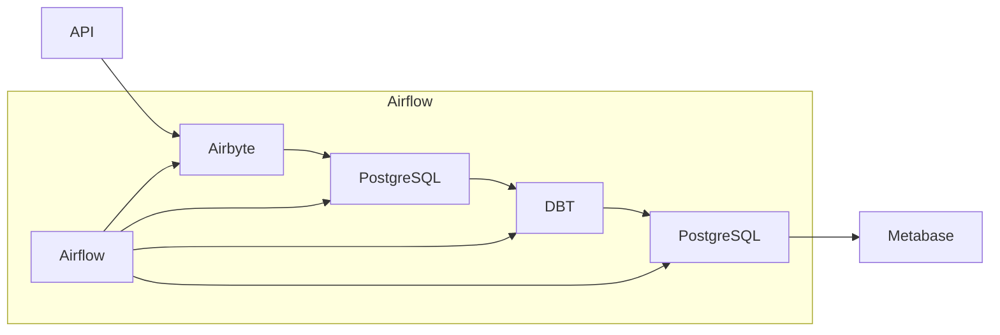

# Painel de Monitoramento de Criptomoedas

Este projeto cria um pipeline de dados para monitoramento e análise de preços de criptomoedas, utilizando a API pública do `CoinGecko`. 

Os dados são `coletados`, `transformados`, `armazenados` e `visualizados` em um painel de Business Intelligence (BI).

## Arquitetura do Projeto



## Tecnologias Utilizadas

- `Airbyte`: Para integração e extração de dados da API CoinGecko.

- `Airflow`: Para orquestração de ELT (Extract, Load, Transform).

- `PostgreSQL`: Será nosso DW (Data Warehouse) para armazenamento e modelagem de dados.

- `DBT (Data Build Tool)`: Nossa ferramenta de modelagem, ela também vai zelar pela qualidade dos dados.

- `Metabase`: Será nossa dataviz, onde vamos criar painéis para visualização dos dados.

- `Grafana`: Para monitoramento e visualização de métricas do ambiente.

## Estrutura do Projeto

- Coleta de Dados
    - Configurar Airbyte para integração com a API do CoinGecko.
    - Configurar Airbyte para enviar dados coletados para o PostgreSQL.

- Orquestração de Tarefas
    - Configurar Airflow para agendamento e execução de tarefas ELT.

- Armazenamento de Dados
    - Configurar PostgreSQL para armazenamento de dados brutos e transformados.

- Transformação de Dados
    - Criar modelos DBT para transformação e limpeza de dados no PostgreSQL.

- Visualização de Dados
    - Criar painéis no Metabase para visualização dos dados.

- Monitoramento
    - Configurar Prometheus para coleta de métricas do sistema.
    - Configurar Grafana para visualização de métricas.

## Passo a Passo para Implementação

1. Já configuramos nosso ambiente de desenvolvimento pode ver completo [aqui](https://github.com/Linhares015/athena_stack_infra)

2. Configuração do Airbyte

    - Acesse a interface do Airbyte em http://localhost:8000.
    - Adicione uma nova conexão usando a API CoinGecko:
        - `Source`: HTTP API Source
        - `Destination`: PostgreSQL

    - Exemplo de Configuração da API CoinGecko:

        - URL: https://api.coingecko.com/api/v3/coins/markets?vs_currency=usd
        - Method: GET
        - Query Parameters:
        - vs_currency: usd
        - order: market_cap_desc
        - per_page: 100
        - page: 1
        - sparkline: false

    - Configurar Destino no Airbyte

    - Configure o PostgreSQL como destino:
        - Host: seu_host_postgres
        - Port: 5432
        - Database: airbyte
        - Username: seu_usuario
        - Password: sua_senha

3. Configuração do Airflow
    - Criar DAG no Airflow
    - Crie um arquivo DAG no Airflow para orquestrar as tarefas de ETL:
```python
from datetime import timedelta
from airflow import DAG
from airflow.operators.python_operator import PythonOperator
from airflow.utils.dates import days_ago
import requests
from requests.auth import HTTPBasicAuth
import logging
import time

default_args = {
    'owner': 'airflow',
    'depends_on_past': False,
    'email_on_failure': False,
    'email_on_retry': False,
    'retries': 1,
    'retry_delay': timedelta(minutes=5),
}

def trigger_airbyte_crypto():
    airbyte_connection_id = '3ad7e960-3179-45fd-8e2c-823344469abb'
    airbyte_crypto_url = 'http://IP:8001/api/v1/connections/sync'
    airbyte_job_status_url = 'http://IP:8001/api/v1/jobs/get'
    headers = {'Content-Type': 'application/json'}
    payload = {'connectionId': airbyte_connection_id}
    
    auth = HTTPBasicAuth('airbyte', 'password')
    
    response = requests.post(airbyte_crypto_url, headers=headers, json=payload, auth=auth)
    response.raise_for_status()
    
    job_id = response.json()['job']['id']
    logging.info('Airbyte sync job started: %s', job_id)
    
    timeout = 3600
    check_interval = 3
    elapsed_time = 0
    
    while elapsed_time < timeout:
        job_status_response = requests.post(airbyte_job_status_url, headers=headers, json={'id': job_id}, auth=auth)
        job_status_response.raise_for_status()
        job_status = job_status_response.json()['job']['status']
        
        if job_status == 'succeeded':
            logging.info('Airbyte sync succeeded: %s', job_status_response.json())
            return {'job_id': job_id, 'status': 'succeeded'}
        elif job_status == 'failed':
            logging.error('Airbyte sync failed: %s', job_status_response.json())
            raise Exception('Airbyte sync failed')
        else:
            logging.info('Airbyte sync in progress: %s', job_status)
            time.sleep(check_interval)
            elapsed_time += check_interval
    
    raise Exception('Airbyte sync timed out')

with DAG(
    'airbyte_crypto_dag',
    default_args=default_args,
    description='DAG to trigger Airbyte sync',
    schedule_interval=timedelta(days=1),
    start_date=days_ago(1),
    tags=['airbyte','Postgres_DW','crypto_data'],
) as dag:

    run_airbyte_crypto = PythonOperator(
        task_id='run_airbyte_crypto',
        python_callable=trigger_airbyte_crypto,
    )

    run_airbyte_crypto

```
4. Configuração do PostgreSQL
Configurar Esquemas e Tabelas
Conecte-se ao PostgreSQL e crie os esquemas e tabelas necessários para armazenar os dados brutos e transformados.

5. Desenvolvimento da Transformação de Dados no DBT.

6. Visualização de Dados no Metabase

    - Crie painéis para visualizar preços atuais, históricos e tendências de mercado.
    - Indicadores de Desempenho (KPIs) sugeridos:
    - Preço atual (current_price)
    - Capitalização de mercado (market_cap)
    - Volume total (total_volume)
    - Variação percentual de preço nas últimas 24h (price_change_percentage_24h)
    - Maior preço nas últimas 24h (high_24h)
    - Menor preço nas últimas 24h (low_24h)

7. Monitoramento com Prometheus e Grafana
Configurar Prometheus

## Considerações Finais

Este projeto demonstra habilidades em integração de dados, ETL, armazenamento e visualização em BI, utilizando uma infraestrutura completa com Airbyte, Airflow, PostgreSQL, DBT, Prometheus e Grafana.
