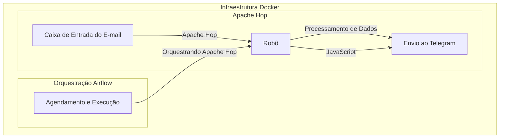

# Projeto Robô envio de alertas Telegram

## Solicitação do cliente

O cliente recebe alertas de vários sistemas de monitoramento, e gostaria de centralizar todos esses alertas em um único local, o Telegram.

Um dos problemas principais é que os alertas são enviados por e-mail, e o cliente gostaria de receber esses alertas em tempo real, sem precisar ficar verificando a caixa de e-mail.

Uma coisa importante é que o cliente quer o controle de versionamento do código, para que ele possa fazer alterações futuras e trabalhar com outros desenvolvedores, então ele pediu para que o código seja versionado no GitHub.

## Solução

Desenvolver um robô que leia a caixa de entrada do e-mail, personalize a mensagem e envie para o Telegram.

Vamos usar o Apache Hop para fazer a extração dos e-mails, e o JavaScript para fazer a personalização da mensagem e envio para o Telegram.

Vamos usar o Airflow para agendar a execução do robô.

## Arquitetura do Projeto

## Pré-requisitos

- Docker
- Docker Compose
- Conta no Telegram
- Conta no Gmail

## Configuração

### Configuração do Telegram

1. Acesse o Telegram e procure por `BotFather`
2. Crie um novo bot com o comando `/newbot`
3. Copie o token gerado

### Configuração do Gmail

1. Acesse o Gmail e ative o acesso a aplicativos menos seguros
2. Copie o e-mail e senha
