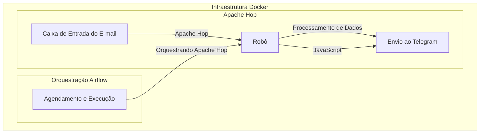
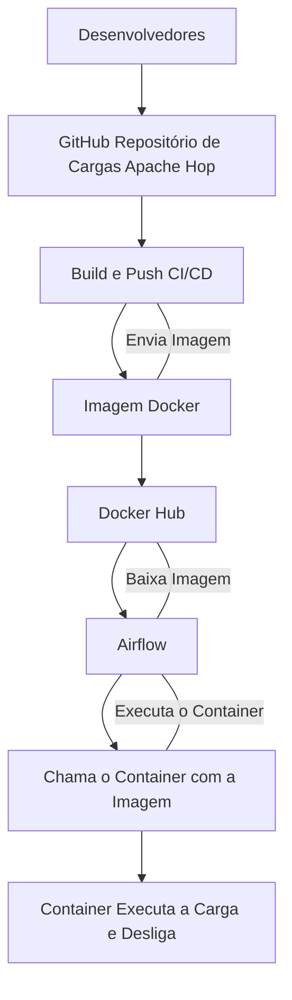

# Projeto Robô envio de alertas Telegram
- [repositório com os arquivos](https://github.com/Linhares015/apche_hop_cargas)
    - ### Objetivo
        Projeto de dados para ler e analisar e-mails para poder enviar alertas de dados para um grupo no Telegram.

    - ### Tecnologias Utilizadas
        - 
        - 
        - 
        - 
        - 

    - ### Aulas Youtube
        - [Vídeo Parte 1 - Ingestão de dados do e-mail via apache hop](https://youtu.be/-Ng0xpuSvNA)
        - [Vídeo Parte 2 - Loop de envio ao telegram via apache hop](https://youtu.be/6-WaTLmzj9s)

## Solicitação do cliente

O cliente recebe alertas de vários sistemas de monitoramento, e gostaria de centralizar todos esses alertas em um único local, o Telegram.

Um dos problemas principais é que os alertas são enviados por e-mail, e o cliente gostaria de receber esses alertas em tempo real, sem precisar ficar verificando a caixa de e-mail.

Uma coisa importante é que o cliente quer o controle de versionamento do código, para que ele possa fazer alterações futuras e trabalhar com outros desenvolvedores, então ele pediu para que o código seja versionado no GitHub.

## Solução

Desenvolver um robô que leia a caixa de entrada do e-mail, personalize a mensagem e envie para o Telegram.

Vamos usar o Apache Hop para fazer a extração dos e-mails, e o JavaScript para fazer a personalização da mensagem e envio para o Telegram.

Vamos usar o Airflow para agendar a execução do robô.

## Arquitetura do Projeto

## Configuração

- ### Configuração do Telegram

1. Acesse o Telegram e procure por `BotFather`
2. Crie um novo bot com o comando `/newbot`
3. Copie o token gerado

- ### Configuração do Gmail

1. Acesse o Gmail e ative o acesso a aplicativos menos seguros
2. Copie o e-mail e senha
3. Ative a autenticação em dois fatores
4. Pesquise app password e crie uma senha para o Apache Hop
5. Ative o pop3 nas configurações do Gmail

- ### Configuração do Apache Hop

1. Use o step input email para ler os e-mails
configuração:
    - Protocolo: pop3
    - Servidor: pop.gmail.com
    - Porta: 995
    - Usuário: seu e-mail
    - Senha: senha do app que você criou la no Gmail
    - SSL: true

- ### Configurações da imagem Docker

1. Criar uma imagem que seja capaz de executar o Apache Hop e nossos projetos nele com um entrypoint;

2. Build da imagem;

3. Tag da imagem;

4. Push da imagem;

5. Tag no repositório do GitHub;

6. Automatizar o build e push da imagem via GitHub Actions;

7. Configuração do Airflow para executar a imagem;

## Arquitetura Final do Projeto

