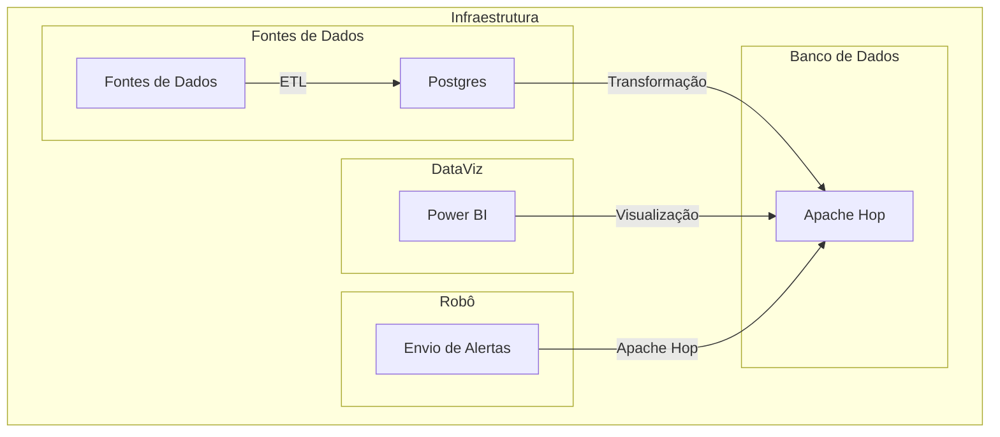

# Projeto - Zero Inadimplência

- ## Projeto Zero Inadimplência - Dez/2024 - Em andamento

    - ### Objetivo
        Projeto de dados para controlar a inadimplência de clientes de uma empresa.

    - ### Tecnologias Utilizadas
        - 
        - 
        - 
        - 

    - ### Aulas Youtube
        - [Vídeo Parte 1](https://youtu.be/1Q1w1J1Y1Qw)
        - [Vídeo Parte 2](https://youtu.be/1Q1w1J1Y1Qw)

- ## Solicitação do cliente

O cliente está enfrentando problemas com a inadimplência de seus clientes, e gostaria de ter um controle mais efetivo sobre isso.

Ele não possui nenhum controle sobre a inadimplência, e gostaria de ter um dashboard para poder visualizar os clientes inadimplentes, métricas sobre a inadimplência e sobre a equipe de cobrança.

Ele gostaria também de enviar alertas para a equipe de cobrança, para que eles possam agir rapidamente e evitar que a inadimplência aumente.

Enviar aos clientes, por e-mail, alertas sobre a inadimplência e 5 dias antes das faturas vencerem, para que eles possam regularizar a situação.

- ## Solução

Desenvolver um ETL para extrair os dados de inadimplência, transformar e carregar em um banco de dados.

Desenvolver um dashboard para visualização dos dados com métricas sobre a inadimplência e sobre a equipe de cobrança.

Desenvolver um robô para enviar alertas para a equipe de cobrança e para os clientes.

- ## Arquitetura do Projeto

Os arquivos do projeto estão disponíveis nessa pasta.